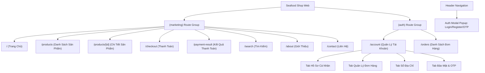

# 🦀 TỔNG QUAN VÀ TÀI LIỆU DỰ ÁN SEAFOOD SHOP WEB (HẢI SẢN PHAN THIẾT)

> **Ghi chú**: Đây là file tài liệu tổng hợp chính thức của dự án **Bán Hải Sản Phan Thiết (Seafood Shop Web)**. File này ghi nhận đầy đủ hiện trạng dự án, kiến trúc, cây thư mục cực kỳ chi tiết, danh sách dependencies, các màn hình chức năng & routes đã hoàn thiện. Tài liệu này được duy trì và cập nhật liên tục sau mỗi feature hoặc thay đổi mã nguồn.

---

## 📌 1. TỔNG QUAN DỰ ÁN

- **Tên dự án**: Hải Sản Phan Thiết — Seafood Shop Web
- **Lĩnh vực / Mục đích**: Website Thương Mại Điện Tử chuyên kinh doanh hải sản tươi sống đánh bắt tại biển Phan Thiết (Bình Thuận), hải sản đông lạnh xuất khẩu và các loại hải sản chế biến sẵn.
- **Mục tiêu Trải nghiệm Nguồn dùng**:
  - Giao diện bán hải sản hiện đại, màu sắc chủ đạo mang hơi hướng đại dương (Ocean/Blue/Amber Accent), tối ưu trải nghiệm mua hàng (UX).
  - Tốc độ tải trang siêu nhanh, chuẩn SEO tối ưu bằng Server-Side Rendering (SSR) & Server Components (RSC) của Next.js 16.
  - Hỗ trợ Đa ngôn ngữ (i18n) tự động theo URL (Tiếng Việt, Tiếng Anh,...).
  - Tích hợp REST API Backend linh hoạt, cơ chế 401 Auto-Refresh JWT Token, Type-safe toàn diện với TypeScript & Zod Schema.
  - Hiển thị đầy đủ trạng thái dữ liệu: Loading (Skeleton), Empty State và Error Toast/Alert.
  - Định dạng hiển thị tiền tệ chuẩn Việt Nam (`320.000₫`), 100% tiếng Việt thân thiện với người tiêu dùng.
- **Node.js Engine**: `>= 24.0.0`
- **Package Manager**: `bun` / `npm` / `pnpm`

---

## 🌳 2. CẤU TRÚC THƯ MỤC CHI TIẾT (PROJECT DIRECTORY TREE)

Dưới đây là sơ đồ cây thư mục chi tiết toàn bộ dự án:

```text
seafood-shop-web/
├── .agents/                        # Chứa quy tắc (rules) và kỹ năng (skills) dành cho AI Agent
│   ├── rules/                      # Quy tắc lập trình & tiêu chuẩn dự án
│   └── skills/                     # Các kịch bản kỹ năng AI (api-integration, ui-ux, testing, hallmark)
├── .github/                        # Workflows CI/CD GitHub Actions & cấu hình GitHub
├── .storybook/                     # Cấu hình Storybook Component Explorer
├── .vscode/                        # Cấu hình khuyến nghị extensions và workspace cho VS Code
├── docs/                           # Tài liệu chi tiết specs & quy ước lập trình
│   ├── conventions/                # Quy ước phát triển (components.md, data-fetching.md, state.md)
│   ├── specs/                      # Thông số kỹ thuật
│   │   ├── api-contract.md         # API Specification chuẩn từ Backend (Base URL: http://localhost:8085/api/v1)
│   │   ├── constitution.md         # Quy chuẩn chất lượng & nguyên tắc bất biến của dự án
│   │   ├── design-spec.md          # Design system spec (Màu sắc, Spacing Scale 4-96px, Typography)
│   │   └── features/               # Specs cho các tính năng mới
│   └── PROJECT_STRUCTURE.md        # File sơ đồ tổng quan dự án ở thư mục docs
├── public/                         # Chứa tài nguyên tĩnh: hình ảnh hải sản, logo, favicon, banners
├── src/                            # MÃ NGUỒN CHÍNH CỦA ỨNG DỤNG
│   ├── app/                        # Next.js 16 App Router (Routing Engine)
│   │   ├── [locale]/               # Route động theo mã ngôn ngữ (vi, en, fr...)
│   │   │   ├── (auth)/             # Route Group dành cho các màn hình yêu cầu xác thực / tài khoản
│   │   │   │   ├── account/        # Trang Quản lý tài khoản cá nhân (/account)
│   │   │   │   │   └── page.tsx    # Page component quản lý tài khoản
│   │   │   │   ├── orders/         # Trang Quản lý danh sách đơn hàng (/orders)
│   │   │   │   │   └── pgae.tsx    # Page component đơn hàng
│   │   │   │   └── layout.tsx      # Auth Sub-layout
│   │   │   ├── (marketing)/        # Route Group dành cho các trang public / storefront
│   │   │   │   ├── about/          # Trang Giới thiệu (/about)
│   │   │   │   │   └── page.tsx
│   │   │   │   ├── checkout/       # Trang Thanh toán đơn hàng (/checkout)
│   │   │   │   │   └── page.tsx
│   │   │   │   ├── contact/        # Trang Liên hệ (/contact)
│   │   │   │   │   └── page.tsx
│   │   │   │   ├── payment-result/ # Trang Kết quả thanh toán (/payment-result)
│   │   │   │   │   └── page.tsx
│   │   │   │   ├── products/       # Trang Danh sách sản phẩm / Catalog (/products)
│   │   │   │   │   ├── [id]/       # Trang Chi tiết sản phẩm (/products/[id])
│   │   │   │   │   │   └── page.tsx
│   │   │   │   │   ├── ProductGrid.tsx
│   │   │   │   │   └── page.tsx
│   │   │   │   ├── search/         # Trang Tìm kiếm sản phẩm (/search)
│   │   │   │   │   └── page.tsx
│   │   │   │   ├── layout.tsx      # Marketing Sub-layout (bao gồm Header & Footer)
│   │   │   │   └── page.tsx        # TRANG CHỦ (Home Page /)
│   │   │   └── layout.tsx          # Root Locale Layout (Bọc NextIntlClientProvider)
│   │   ├── api/                    # Local Next.js API Routes (nếu dùng)
│   │   ├── global-error.tsx        # Bắt lỗi toàn cục của ứng dụng
│   │   ├── providers.tsx           # Client Providers Wrapper (TanStack Query Provider)
│   │   ├── robots.ts               # File robots.txt động tối ưu SEO
│   │   └── sitemap.ts              # File sitemap.xml động tối ưu SEO
│   ├── components/                 # Các thành phần giao diện (UI Components)
│   │   ├── account/                # Components trang Quản lý tài khoản
│   │   │   ├── AccountAddressesTab.tsx  # Tab quản lý sổ địa chỉ giao hàng
│   │   │   ├── AccountContainer.tsx     # Container bao bọc giao diện account
│   │   │   ├── AccountOrdersTab.tsx     # Tab quản lý lịch sử & chi tiết đơn hàng
│   │   │   ├── AccountProfileTab.tsx    # Tab chỉnh sửa thông tin cá nhân
│   │   │   ├── AccountSecurityTab.tsx   # Tab quản lý đổi mật khẩu & OTP bảo mật
│   │   │   └── AccountSidebar.tsx       # Sidebar menu điều hướng tài khoản
│   │   ├── auth/                   # Components phục vụ xác thực người dùng
│   │   │   └── AuthModal.tsx        # Modal Popup Đăng nhập / Đăng ký / Xác nhận OTP
│   │   ├── common/                 # Components dùng chung toàn hệ thống
│   │   │   └── Icon.tsx             # Wrapper icon hiển thị
│   │   ├── home/                   # Components thuộc Trang Chủ
│   │   │   ├── BentoCategories.tsx  # Danh mục sản phẩm bố trí theo Bento Grid
│   │   │   ├── FeaturedProducts.tsx # Sản phẩm nổi bật / bán chạy
│   │   │   ├── HeroSection.tsx      # Hero Banner đại dương chào mừng
│   │   │   ├── MarqueeStrip.tsx     # Thanh chữ chạy thông báo ưu đãi / hải sản mới cập bến
│   │   │   └── UspSection.tsx       # 4 Cam kết dịch vụ (Tươi sống 100%, Giao 2h, Nguồn gốc Phan Thiết, Đổi trả)
│   │   ├── layout/                 # Components bố cục trang
│   │   │   ├── Footer.tsx           # Footer chân trang đầy đủ thông tin thương hiệu, liên hệ, chính sách
│   │   │   └── Header.tsx           # Header đầu trang tích hợp Thanh tìm kiếm, Giỏ hàng, Nút Đăng nhập/Tài khoản
│   │   ├── product-detail/         # Components thuộc Trang Chi tiết Sản phẩm
│   │   │   ├── ProductDetailBreadcrumb.tsx # Thanh điều hướng đường dẫn (Breadcrumb)
│   │   │   ├── ProductDetailContainer.tsx  # Layout container chi tiết sản phẩm
│   │   │   ├── ProductGallery.tsx          # Bộ sưu tập ảnh sản phẩm + thumbnails
│   │   │   ├── ProductPurchasePanel.tsx    # Bảng đặt mua: Chọn trọng lượng, số lượng, chọn quy cách, nút Mua
│   │   │   └── ProductTabs.tsx             # Tabs thông tin: Mô tả, Nguồn gốc & Bảo quản, Đánh giá
│   │   ├── products/               # Components thuộc Trang Danh sách Sản phẩm (Catalog)
│   │   │   ├── ProductCard.tsx            # Card sản phẩm hải sản (ảnh, tag, giá, nút thêm vào giỏ)
│   │   │   ├── ProductCatalogContainer.tsx# Container tổng thể danh sách & bộ lọc
│   │   │   ├── ProductCatalogGrid.tsx     # Lưới hiển thị danh sách sản phẩm
│   │   │   ├── ProductHeaderBanner.tsx    # Banner tiêu đề trang danh mục
│   │   │   ├── ProductListToolbar.tsx     # Toolbar sắp xếp (giá, mới nhất), chọn Grid/List view
│   │   │   ├── ProductPagination.tsx      # Thanh phân trang (Pagination)
│   │   │   └── ProductSidebarFilter.tsx   # Bộ lọc nâng cao (Danh mục, Khoảng giá, Đánh giá, Trạng thái)
│   │   ├── ui/                     # Shadcn UI primitives (Re-usable UI components gốc)
│   │   │   ├── avatar.tsx, badge.tsx, button.tsx, card.tsx, dialog.tsx, dropdown-menu.tsx,
│   │   │   ├── input.tsx, separator.tsx, sheet.tsx, skeleton.tsx, sonner.tsx, table.tsx
│   │   ├── Icon.tsx, LocaleSwitcher.tsx, Logo.tsx
│   ├── data/                       # Mock Data phục vụ phát triển & test UI trước khi nối API
│   │   ├── account-mock.ts         # Mock data người dùng, đơn hàng, địa chỉ
│   │   ├── home-mock.ts            # Mock data banner, danh mục bento, sản phẩm nổi bật
│   │   ├── product-detail-mock.ts  # Mock data chi tiết sản phẩm hải sản
│   │   └── products-catalog-mock.ts# Mock data danh sách sản phẩm và bộ lọc catalog
│   ├── lib/ & libs/                # Thư viện core & modules tích hợp hệ thống
│   │   ├── api/                    # Modules gọi API REST theo từng domain (ví dụ: products.ts)
│   │   ├── ApiClient.ts            # Axios Instance cấu hình sẵn Base URL & Interceptor 401 Refresh Token
│   │   ├── Arcjet.ts               # Cấu hình Arcjet Security (bảo vệ Bot & Rate limit)
│   │   ├── Env.ts                  # Validated Environment variables bằng Zod Schema
│   │   ├── I18n.ts                 # Cấu hình Server-side i18n
│   │   ├── I18nNavigation.ts       # Navigation helpers hỗ trợ i18n
│   │   ├── I18nRouting.ts          # Định nghĩa danh sách ngôn ngữ hỗ trợ
│   │   └── Logger.ts               # Logger wrapper từ LogTape
│   ├── locales/                    # Chứa các file từ điển dịch thuật i18n (en.json, fr.json...)
│   ├── models/                     # Mô hình dữ liệu ORM (Drizzle)
│   ├── styles/                     # Stylesheet toàn cục (`global.css` chứa Tailwind CSS v4 design tokens)
│   ├── templates/                  # Templates layout mẫu
│   ├── types/                      # Định nghĩa TypeScript Types
│   │   ├── api.ts                  # Types chuẩn API Response (`ApiResponse<T>`, `PageResponse<T>`, `productSchema`)
│   │   └── I18n.ts                 # Types i18n
│   ├── utils/                      # Utilities bổ trợ (`AppConfig.ts`, `Helpers.ts`)
│   ├── validations/                # Chứa các Zod Schema validate form dữ liệu
│   ├── instrumentation.ts          # Khởi tạo Sentry Server runtime
│   ├── instrumentation-client.ts   # Khởi tạo Sentry Client runtime
│   └── proxy.ts                    # Next.js Proxy/Middleware security
├── tests/                          # THƯ MỤC KIỂM THỬ (TESTING SUITE)
│   ├── e2e/                        # Playwright End-to-End Tests
│   │   ├── I18n.e2e.ts             # Test chuyển đổi ngôn ngữ
│   │   ├── Sanity.check.e2e.ts     # Smoke test kiểm tra tình trạng app
│   │   └── Visual.e2e.ts           # Visual regression test
│   ├── integration/                # Integration tests
│   └── ProductGrid.integ.tsx       # Component Integration Test cho ProductGrid
├── AGENTS.md                       # Quy chuẩn lập trình bắt buộc dành cho AI Agent & Developer
├── README.md                       # Hướng dẫn khởi chạy dự án
├── bun.lock / package.json         # Khai báo gói phụ thuộc (Dependencies) và các script lệnh
├── checkly.config.ts               # Cấu hình giám sát Checkly (Monitoring as Code)
├── commitlint.config.ts            # Cấu hình kiểm tra cú pháp commit Git
├── components.json                 # Cấu hình Shadcn UI & Alias `@/`
├── crowdin.yml                     # Cấu hình đồng bộ bản dịch i18n với Crowdin
├── knip.config.ts                  # Cấu hình quét mã nguồn thừa knip
├── lefthook.yml                    # Cấu hình Git pre-commit & commit-msg hooks
├── next.config.ts                  # Cấu hình Next.js (Sentry, i18n, Bundle Analyzer, React Compiler)
├── oxfmt.config.ts                 # Cấu hình Code Formatter (oxfmt)
├── oxlint.config.ts                # Cấu hình Code Linter (oxlint)
├── playwright.config.ts            # Cấu hình E2E Test Playwright
├── tsconfig.json                   # Cấu hình TypeScript & Path Aliases
└── vitest.config.ts                # Cấu hình Vitest runner (Unit & Integration tests)
```

---

## 📦 3. DANH SÁCH THƯ VIỆN & DEPENDENCIES (`package.json`)

### 3.1 Core Framework & Runtime
- **Next.js (`v16.2.6`)**: Framework cốt lõi hỗ trợ App Router, Server Components, React Compiler và Server Actions.
- **React / React DOM (`v19.2.6`)**: Thư viện UI phiên bản mới nhất kết hợp với React Compiler giúp tự động memoize UI.
- **TypeScript (`v5.9.3`)**: Đảm bảo an toàn kiểu dữ liệu (Strict Type-Safety) toàn bộ ứng dụng.

### 3.2 Main Dependencies (Thư viện chính Runtime)

| Thư viện | Phiên bản | Công dụng chi tiết trong dự án |
| :--- | :--- | :--- |
| `@tanstack/react-query` | `^5.101.4` | Quản lý Async State, Server State Caching, tự động re-fetch và sync dữ liệu client-side. |
| `axios` | `^1.8.1` | HTTP Client thực hiện gọi API Backend RESTful với interceptor tự động làm mới JWT Access Token khi nhận lỗi 401. |
| `zod` | `^4.4.3` | Định nghĩa validation schema & kiểm tra tính hợp lệ của API response, form dữ liệu và biến môi trường runtime. |
| `next-intl` | `^4.12.0` | Thư viện Đa ngôn ngữ (i18n) cho Next.js App Router, hỗ trợ routing tự động `/[locale]/`. |
| `@t3-oss/env-nextjs` | `^0.13.11` | Khởi tạo biến môi trường an toàn Type-safe (`Env.ts`). |
| `@arcjet/next` | `^1.4.0` | Middleware bảo vệ bảo mật, chống bot độc hại và giới hạn tần suất gửi request (Rate Limiting). |
| `@sentry/nextjs` | `^10.53.1` | Giám sát lỗi ứng dụng (Error Tracking), theo dõi hiệu năng (Performance Tracing) thời gian thực. |
| `@logtape/logtape` | `^2.1.1` | Trình ghi log hệ thống dạng cấu trúc (Structured Logging) thay thế cho Pino.js. |
| `react-hook-form` | `^7.76.0` | Quản lý state của các biểu mẫu (Form), tối ưu performance render. |
| `@hookform/resolvers` | `^5.2.2` | Tích hợp Zod schema làm validator trực tiếp cho `react-hook-form`. |
| `sonner` | `^2.0.6` | Hiển thị thông báo Toast đẹp mắt khi thêm giỏ hàng, cập nhật thông tin, thông báo lỗi. |
| `clsx` & `tailwind-merge` | `^2.1.1` / `^3.6.0` | Helper tiện ích nối class và giải quyết xung đột Tailwind CSS utility classes. |
| `tw-animate-css` | `^1.3.4` | Thư viện hiệu ứng chuyển động animation tối ưu cho Tailwind CSS v4. |
| `next-themes` | `^0.4.6` | Quản lý Theme giao diện (Light / Dark mode). |
| `lucide-react` | `^1.28.0` | Bộ Icon vector phong phú dùng cho giao diện storefront. |

### 3.3 DevDependencies (Công cụ Phát triển & Testing)

- **Kiểm Thử (Testing Frameworks)**:
  - `vitest` (`^4.1.7`), `@vitest/browser`, `@vitest/browser-playwright`: Bộ công cụ chạy Unit test & Component test cực nhanh trong trình duyệt.
  - `@playwright/test` (`^1.60.0`): Framework kiểm thử End-to-End (E2E) tự động thao tác trình duyệt.
  - `@chromatic-com/playwright` (`^0.14.2`): Kiểm thử giao diện dạng Visual Regression.
  - `@faker-js/faker` (`^10.4.0`): Tạo dữ liệu giả lập (mock data) chất lượng cho testing.
- **UI Components Workshop**:
  - `storybook` (`^10.4.1`), `@storybook/nextjs-vite`, `@storybook/addon-a11y`, `@storybook/addon-docs`, `@storybook/addon-vitest`: Môi trường xây dựng và phát triển độc lập các UI Components.
- **Code Quality & Linter/Formatter**:
  - `ultracite` (`^7.7.0`): Bộ công cụ linter & formatter tiêu chuẩn cao.
  - `oxlint` (`^1.66.0`), `oxlint-tsgolint`: Linter tốc độ siêu nhanh viết bằng Rust.
  - `oxfmt` (`^0.51.0`): Code Formatter tốc độ cao thay thế Prettier.
  - `knip` (`^6.14.2`): Tìm kiếm mã nguồn dư thừa, file/export không được sử dụng.
  - `@lingual/i18n-check` (`^0.9.5`): Kiểm tra tính nhất quán giữa các file dịch i18n.
- **CI/CD, Git Hooks & Monitoring**:
  - `lefthook` (`^2.1.8`), `@commitlint/cli`: Quản lý Git Hooks (pre-commit, commit-msg chuẩn Conventional Commits).
  - `semantic-release` (`^25.0.3`): Tự động tạo phiên bản phát hành từ lịch sử git commit.
  - `checkly` (`^7.14.0`): Giám sát uptime và E2E flow môi trường thật.
  - `@spotlightjs/spotlight` (`^4.11.4`): Overlay thông tin debug trực tiếp tại local.
  - `@tailwindcss/postcss` (`^4.3.0`), `tailwindcss` (`^4.3.0`): Engine Tailwind CSS v4.

---

## 🖥️ 4. DANH SÁCH MÀN HÌNH CHỨC NĂNG VÀ ROUTES

Hiện tại dự án đã xây dựng hoàn thiện các màn hình storefront chính với giao diện chuẩn UI/UX hải sản:



### 4.1 Chi Tiết Các Màn Hình Đã Có

1. **Trang Chủ (Home Page) — Route: `/[locale]/`**
   - **File**: `src/app/[locale]/(marketing)/page.tsx`
   - **Các Component**:
     - `HeroSection.tsx`: Banner thương hiệu đại dương, câu khẩu hiệu "Hải Sản Phan Thiết Tươi Sống Đánh Bắt Trong Ngày", CTA mua sắm.
     - `MarqueeStrip.tsx`: Dải chữ chạy thông báo ưu đãi và hải sản vừa cập bến.
     - `UspSection.tsx`: 4 Cam kết vàng (100% Tươi sống, Giao nhanh 2h, Nguồn gốc chuẩn Phan Thiết, Đổi trả 1-1).
     - `FeaturedProducts.tsx`: Danh sách sản phẩm bán chạy / hải sản HOT có tag giảm giá, badge tươi sống và nút chọn mua.
     - `BentoCategories.tsx`: Bố cục danh mục hải sản dạng Bento Grid độc đáo (Tôm hùm, Cua/Ghẹ Phan Thiết, Cá tươi, Mực/Bạch tuộc, Ốc/Sò, Hải sản khô).

2. **Trang Danh Sách Sản Phẩm (Product Catalog) — Route: `/[locale]/products`**
   - **File**: `src/app/[locale]/(marketing)/products/page.tsx`
   - **Các Component**:
     - `ProductHeaderBanner.tsx`: Header banner danh mục sản phẩm.
     - `ProductSidebarFilter.tsx`: Bộ lọc thông minh cạnh trái (Lọc theo danh mục hải sản, khoảng giá sliders, đánh giá sao, tình trạng hàng còn/hết, quy cách tươi/đông lạnh).
     - `ProductListToolbar.tsx`: Toolbar tùy chọn sắp xếp (Mới nhất, Giá tăng/giảm, Bán chạy nhất) và chuyển đổi chế độ xem Grid / List.
     - `ProductCatalogGrid.tsx`: Lưới hiển thị danh sách sản phẩm hải sản chuẩn card responsive.
     - `ProductPagination.tsx`: Phân trang danh sách sản phẩm.

3. **Trang Chi Tiết Sản Phẩm (Product Detail) — Route: `/[locale]/products/[id]`**
   - **File**: `src/app/[locale]/(marketing)/products/[id]/page.tsx`
   - **Các Component**:
     - `ProductDetailBreadcrumb.tsx`: Đường dẫn phân cấp (Trang chủ > Sản phẩm > Chi tiết).
     - `ProductGallery.tsx`: Bộ sưu tập hình ảnh sản phẩm chất lượng cao kèm bộ xem ảnh thu nhỏ (Thumbnails slider).
     - `ProductPurchasePanel.tsx`: Bảng tương tác mua hàng (Hiển thị giá tiền, đơn vị tính/kg, chọn số lượng, chọn cách sơ chế làm sạch/nguyên con, nút "Thêm vào giỏ" và "Mua ngay").
     - `ProductTabs.tsx`: Nội dung chi tiết gồm 3 Tab (Mô tả sản phẩm, Nguồn gốc & Hướng dẫn bảo quản, Đánh giá thực tế từ người mua).

4. **Trang Quản Lý Tài Khoản (User Account Dashboard) — Route: `/[locale]/account`**
   - **File**: `src/app/[locale]/(auth)/account/page.tsx`
   - **Các Component**:
     - `AccountContainer.tsx`: Bố cục tổng thể trang tài khoản cá nhân.
     - `AccountSidebar.tsx`: Menu tab chọn các mục quản lý.
     - `AccountProfileTab.tsx`: Xem và cập nhật thông tin cá nhân (Họ tên, Email, SĐT, Ngày sinh, Avatar).
     - `AccountOrdersTab.tsx`: Danh sách & Chi tiết đơn hàng đã mua, theo dõi trạng thái đơn hàng (Đợi xác nhận, Đang giao, Đã hoàn thành, Đã hủy).
     - `AccountAddressesTab.tsx`: Sổ địa chỉ nhận hàng (Thêm địa chỉ mới, sửa, xóa, thiết lập địa chỉ mặc định).
     - `AccountSecurityTab.tsx`: Quản lý đổi mật khẩu và kích hoạt xác thực 2 lớp OTP.

5. **Trang Đơn Hàng (Orders) — Route: `/[locale]/orders`**
   - **File**: `src/app/[locale]/(auth)/orders/pgae.tsx`
   - Quản lý danh sách đơn hàng mua hải sản của người dùng.

6. **Trang Thanh Toán (Checkout) — Route: `/[locale]/checkout`**
   - **File**: `src/app/[locale]/(marketing)/checkout/page.tsx`
   - Màn hình điền thông tin người nhận, địa chỉ giao hàng tại TP.HCM/Bình Thuận, ghi chú sơ chế và chọn phương thức thanh toán (COD, chuyển khoản ngân hàng, VNPay/Momo).

7. **Trang Kết Quả Thanh Toán (Payment Result) — Route: `/[locale]/payment-result`**
   - **File**: `src/app/[locale]/(marketing)/payment-result/page.tsx`
   - Màn hình phản hồi kết quả giao dịch thanh toán thành công/thất bại và mã đơn hàng.

8. **Trang Giới Thiệu (About) — Route: `/[locale]/about`**
   - **File**: `src/app/[locale]/(marketing)/about/page.tsx`
   - Giới thiệu về thương hiệu Hải Sản Phan Thiết, quy trình thu mua tại cảng cá và cam kết chất lượng.

9. **Trang Liên Hệ (Contact) — Route: `/[locale]/contact`**
   - **File**: `src/app/[locale]/(marketing)/contact/page.tsx`
   - Form gửi thắc mắc/góp ý và địa chỉ bản đồ cửa hàng.

10. **Trang Tìm Kiếm (Search) — Route: `/[locale]/search`**
    - **File**: `src/app/[locale]/(marketing)/search/page.tsx`
    - Màn hình tìm kiếm nhanh sản phẩm hải sản theo từ khóa.

11. **Modal Auth Xác Thực (Auth Modal Popup)**
    - **File**: `src/components/auth/AuthModal.tsx`
    - Modal popup cho phép Đăng nhập, Đăng ký tài khoản và Nhập mã OTP xác thực số điện thoại/email trực tiếp tại Header mà không cần chuyển hướng trang.

---

## 🛠️ 5. CÁC LỆNH SCRIPT PHÁT TRIỂN (DEVELOPMENT COMMANDS)

Theo quy định tại `AGENTS.md`, chỉ sử dụng các lệnh script tiêu chuẩn dưới đây:

| Lệnh Script | Lệnh Thực Thi | Mô Tả Chức Năng |
| :--- | :--- | :--- |
| `bun run dev` | `run-p dev:*` | Khởi chạy môi trường phát triển local (Next.js server + Spotlight overlay debug). |
| `bun run build-local` | `next build` | Kiểm tra biên dịch và build thử dự án ở local. |
| `bun run lint` | `ultracite check --type-aware --type-check` | Kiểm tra toàn bộ quy chuẩn code linting và type safety. |
| `bun run lint:fix` | `ultracite fix --type-aware --type-check` | Tự động sửa lỗi linting và định dạng code. |
| `bun run check:types` | `tsc --noEmit --pretty` | Kiểm tra lỗi TypeScript mà không tạo ra output build. |
| `bun run check:deps` | `knip` | Quét mã nguồn để phát hiện file/dependencies không dùng đến. |
| `bun run check:i18n` | `i18n-check ...` | Kiểm tra sự đồng bộ và thiếu hụt giữa các file dịch i18n (`en.json`, `fr.json`). |
| `bun run test` | `vitest run` | Chạy toàn bộ bài Unit test & Integration test. |
| `bun run test:e2e` | `playwright test` | Chạy bộ kịch bản kiểm thử End-to-End trên trình duyệt. |
| `bun run storybook` | `storybook dev -p 6006` | Khởi chạy môi trường thiết kế Storybook tại port 6006. |

---

## ⚙️ 6. QUY CHUẨN KỸ THUẬT VÀ QUY TẮC BẤT BIẾN (CONVENTIONS)

1. **Chuẩn API & Kết Nối Backend**:
   - Backend REST API Base URL: `http://localhost:8085/api/v1`.
   - Tất cả API Response phải được bọc trong `ApiResponse<T>`.
   - API phân trang trả về `PageResponse<T>` với chỉ số trang `page` bắt đầu từ `0` (0-indexed).
   - Chỉ gọi API thông qua instance `src/libs/ApiClient.ts` (đã tích hợp sẵn interceptor tự động gọi API refresh token khi gặp lỗi 401).
2. **Thiết Kế Giao Diện (UI/UX & Spacing Scale)**:
   - Spacing chuẩn bắt buộc theo tỉ lệ: `4, 8, 12, 16, 24, 32, 48, 64, 96px`. Không được tự ý dùng số lẻ khác scale (như 18px, 28px).
   - Mỗi màn hình tối đa 3 nhóm màu chủ đạo (Theme hải sản biển: Navy Blue, Teal Accent, Amber Gold).
   - Mọi trang có dữ liệu động phải chuẩn bị đủ 3 trạng thái: **Loading** (Dùng Skeleton primitive, không dùng spinner), **Empty State** và **Error State**.
   - Nội dung giao diện hiển thị 100% tiếng Việt cho người dùng cuối. Định dạng giá tiền: `320.000₫`.
3. **Cấu Trúc Code & TypeScript**:
   - Tuân thủ TypeScript strict type-safe. Không dùng `any`.
   - Sử dụng Named Exports cho components và utilities (trừ các Next.js page/layout exports default theo quy định của framework).
   - Đọc biến môi trường duy nhất qua `src/libs/Env.ts`, không truy cập trực tiếp `process.env`.

---

> **Lưu ý dành cho Developer & AI Agent**: Khi bổ sung feature mới, cập nhật màn hình hoặc thay đổi thư viện, bắt buộc phải cập nhật thông tin tương ứng vào file `PROJECT_OVERVIEW.md` này để giữ tính đồng nhất cho toàn bộ dự án!
