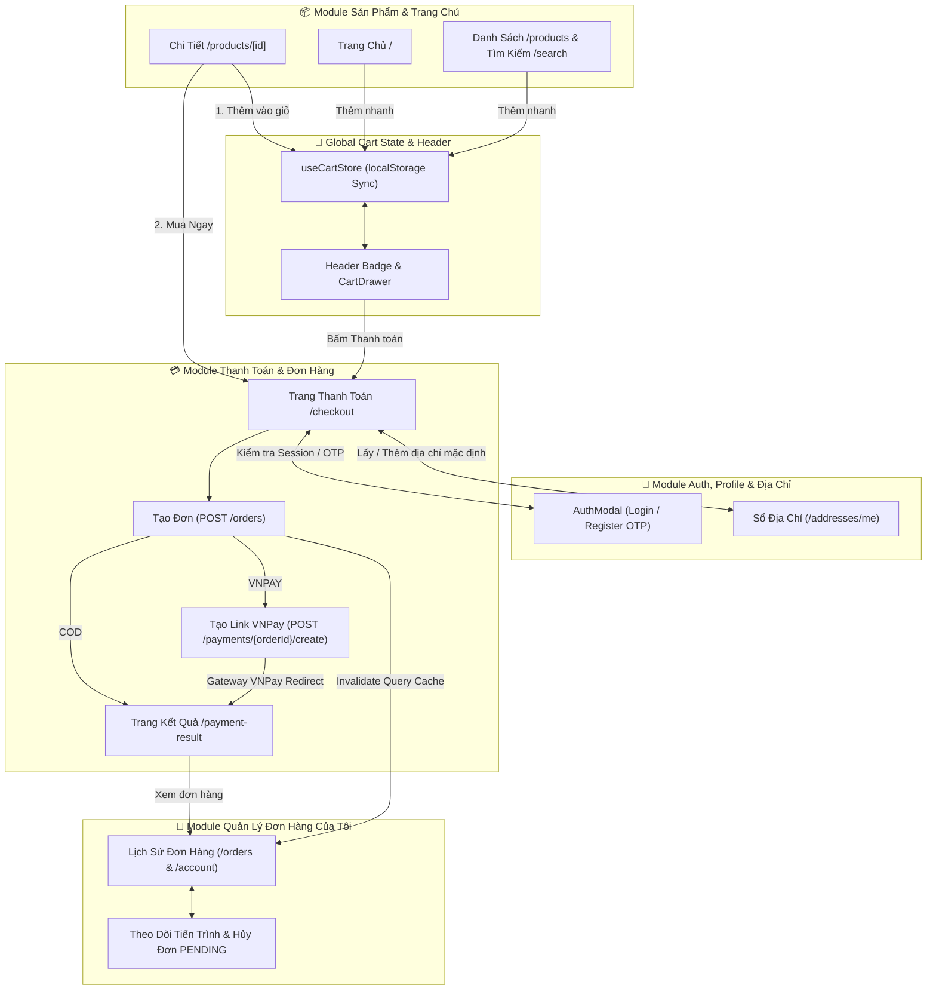

# Technical Spec: Flow "Thêm Giỏ Hàng" & "Thanh Toán Đặt Hàng" (Core Base & Cross-Module Architecture)

> **Mục tiêu**: Thiết lập luồng thương mại điện tử cốt lõi (Core Base) đơn giản, tốc độ, đồng thời đảm bảo **tính liên kết chặt chẽ và nhất quán 100%** giữa flow Giỏ hàng/Thanh toán với toàn bộ các module khác trong hệ thống (Auth, User Profile, Address, Products, Orders, Payments, Layout Header).  
> **Nguyên tắc tinh gọn**:
> - ❌ Không mã khuyến mãi / Không miễn phí ship theo mốc tiền.
> - ❌ Không hệ thống điểm thưởng / tích điểm.
> - ❌ Không giao hỏa tốc hay dịch vụ phụ trợ phức tạp.
> - ✅ Tập trung vào 2 luồng cốt lõi: **Thêm giỏ hàng $\rightarrow$ Thanh toán** và **Mua ngay $\rightarrow$ Thanh toán**.

---

## 1. 🌐 SƠ ĐỒ LIÊN KẾT LIÊN MODULE (CROSS-MODULE ARCHITECTURE MAP)

---

## 2. 🔗 CHI TIẾT ĐÁNH GIÁ SỰ LIÊN KẾT THEO TỪNG MODULE

### 2.1 🔐 Liên Kết Với Module 1: Auth & Security (`/api/v1/auth`)
* **Trải nghiệm khách vãng lai (Guest Checkout Flow)**:
  - Khách chưa đăng nhập vẫn có thể lướt xem, thêm nhiều món vào giỏ hàng và dữ liệu được lưu bền vững trong `localStorage`.
  - Khi bấm "Mua Ngay" hoặc "Tiến Hành Thanh Toán" tại `/checkout`: Hệ thống mở `AuthModal` (Đăng nhập / Đăng ký nhận mã OTP qua Email).
  - Ngay sau khi xác thực thành công $\rightarrow$ Token được lưu vào Cookie/Storage $\rightarrow$ Hệ thống tự động giữ nguyên toàn bộ giỏ hàng và tiếp tục render giao diện Checkout mà không bắt người dùng thao tác lại từ đầu.
* **Xử lý Token hết hạn giữa chừng (Token Expiration)**:
  - Interceptor tại `src/libs/ApiClient.ts` tự động bắt mã `401 Unauthorized`, gọi `POST /api/v1/auth/refresh-token` để cấp mới `accessToken` ngầm mà không làm đứt gãy luồng submit đơn hàng.

---

### 2.2 👤 Liên Kết Với Module 2: User Profile & Sổ Địa Chỉ (`/api/v1/users` & `/api/v1/addresses`)
* **Ràng buộc Snapshot Địa chỉ đơn hàng (Default Address Snapshot Rule)**:
  - Backend quy định khi gọi `POST /api/v1/orders`, hệ thống tự động trích xuất thông tin người nhận và địa chỉ từ bản ghi có cờ `defaultAddress = true`.
* **Đồng bộ hóa 2 chiều giữa Checkout và Sổ Địa Chỉ**:
  - Khi khách hàng thêm địa chỉ mới hoặc đổi địa chỉ giao hàng ngay tại Checkout:
    - Nếu là địa chỉ đầu tiên $\rightarrow$ Tự động gán `defaultAddress: true`.
    - Nếu chọn địa chỉ khác $\rightarrow$ Gọi API `POST /api/v1/addresses/change-address-default/{id}` để cập nhật cờ mặc định.
    - Dữ liệu này tự động đồng bộ ngay lập tức sang trang Quản lý tài khoản (`/account?tab=addresses`) thông qua việc invalidate query key `['users', 'addresses']`.

---

### 2.3 📦 Liên Kết Với Module 3 & 4: Danh Mục Sản Phẩm & Tìm Kiếm (`/api/v1/products`, `/api/v1/categories`)
* **Tính nhất quán về Tồn kho (Stock Consistency)**:
  - Trên Card sản phẩm (`ProductCard`), nếu `stock === 0` hoặc `inStock === false` $\rightarrow$ Nút "Thêm vào giỏ" / "Mua ngay" bị vô hiệu hóa kèm nhãn "Hết hàng".
  - Tại trang Chi tiết sản phẩm (`/products/[id]`): Bộ chọn số lượng bị giới hạn tối đa theo trường `stock` của sản phẩm.
  - Khi vào Giỏ hàng hoặc Checkout: Nếu có sản phẩm bị hết hàng do người khác mua trước $\rightarrow$ Backend trả lỗi `INSUFFICIENT_STOCK` (400), Frontend hiển thị Toast cảnh báo rõ tên món để người dùng cập nhật lại giỏ.
* **Đồng bộ Quy cách & Đơn giá (Price & Spec Sync)**:
  - Đơn giá hiển thị trong Cart Drawer và Checkout phải lấy chính xác từ dữ liệu sản phẩm, định dạng chuẩn tiền tệ Việt Nam `xxx.xxx₫`.

---

### 2.4 🏠 Liên Kết Với Module 5: Trang Chủ (`/api/v1/home`)
* **Nút bấm mua sắm trên các khối Trang chủ**:
  - Khối **Hải sản tươi mới cập bến (Daily Arrivals)**, **Sản phẩm nổi bật (Featured Products)** và **Gói Combo tiệc (Combo Sets)**:
    - Nút "Thêm vào giỏ" kết nối trực tiếp với `useCartStore.addItem()`.
    - Cập nhật tức thì badge giỏ hàng trên Header và mở nhẹ nhàng `CartDrawer` xác nhận.

---

### 2.5 🛒 Liên Kết Với Module 6: Quản Lý Đơn Hàng & Lịch Sử (`/api/v1/orders`)
* **Đồng bộ Cache tức thì sau khi Đặt Hàng**:
  - Khi gọi `useCreateOrderMutation` thành công:
    1. Xóa sạch giỏ hàng (`useCartStore.clearCart()`).
    2. Tự động Invalidate query key `['orders']`.
* **Truy xuất chi tiết và theo dõi đơn hàng**:
  - Từ trang kết quả `/payment-result`, người dùng bấm "Xem Lịch Sử Đơn Hàng" $\rightarrow$ Chuyển thẳng sang `/orders` (hoặc `/account?tab=orders`).
  - Đơn hàng mới lập tức xuất hiện ở đầu danh sách với trạng thái `PENDING` (hoặc `CONFIRMED`).
  - Khách hàng có thể mở Modal theo dõi tiến trình 4 bước (`OrderTrackingModal`) hoặc bấm **"Hủy Đơn Hàng"** (`CancelOrderDialog`) nếu đơn hàng vẫn đang ở trạng thái `PENDING`.

---

### 2.6 💳 Liên Kết Với Module 7: Cổng Thanh Toán VNPay (`/api/v1/payments`)
* **Quy trình kết nối Cổng thanh toán & Trả kết quả**:
  - **Khởi tạo thanh toán**: FE gọi `POST /api/v1/payments/{orderId}/create` $\rightarrow$ Nhận `paymentUrl` $\rightarrow$ Chuyển hướng `window.location.href`.
  - **VNPay Return Callback**: Sau khi khách thao tác trên cổng VNPay, backend xác thực chữ ký số và điều hướng về FE route:
    `http://localhost:3000/payment-result?orderId=...&status=SUCCESS/FAILED&paymentId=...`
  - **Khả năng Thanh Toán Lại (Payment Retry)**:
    - Nếu giao dịch thất bại hoặc khách bấm hủy trên cổng VNPay $\rightarrow$ Đơn hàng trên hệ thống vẫn giữ nguyên ở trạng thái `PENDING`.
    - Trang `/payment-result` và mục `/orders` cung cấp nút **"Thử Thanh Toán Lại"** $\rightarrow$ Tái kích hoạt API `POST /payments/{orderId}/create` lấy link thanh toán mới mà **không tạo đơn hàng rác bị lặp**.

---

### 2.7 🧭 Liên Kết Với Header & Global Layout
* **Badge số lượng & Cart Drawer**:
  - Icon Giỏ hàng trên Header hiển thị số đếm `totalCount` theo thời gian thực.
  - Cart Drawer có thể được mở/đóng từ bất kỳ màn hình nào trong toàn bộ ứng dụng thông qua Global Zustand/External Store.
  - Đồng bộ đa tab: Mở nhiều tab trình duyệt cùng lúc thì giỏ hàng vẫn đồng bộ tức thì nhờ sự kiện `storage`.

---

## 3. ⚠️ DANH SÁCH LƯU Ý KỸ THUẬT & TRÁNH XUNG ĐỘT HỆ THỐNG

1. **Thứ tự thực thi khi Checkout**:
   - `Kiểm tra Auth` $\rightarrow$ `Kiểm tra Giỏ hàng` $\rightarrow$ `Kiểm tra/Cập nhật Địa chỉ mặc định` $\rightarrow$ `Tạo đơn POST /orders` $\rightarrow$ `(Nếu VNPay: Tạo link & Redirect) / (Nếu COD: Redirect Kết quả)` $\rightarrow$ `Clear Giỏ hàng`.
2. **Không xóa giỏ hàng trước khi API tạo đơn thành công**:
   - Chỉ gọi `clearCart()` khi API tạo đơn `POST /orders` đã phản hồi thành công (`res.data.id` tồn tại). Nếu API bị lỗi tồn kho hoặc lỗi mạng $\rightarrow$ Giữ nguyên giỏ hàng để khách không bị mất dữ liệu.
3. **Tránh xung đột trạng thái giữa nhiều Tab**:
   - Khi tab 1 hoàn tất thanh toán và clear cart, tab 2 cũng tự động cập nhật giỏ rỗng, tránh việc người dùng ở tab 2 bấm thanh toán lại lần thứ hai cho cùng một mẻ hàng.
4. **Không gọi API thừa**:
   - Khi xem giỏ hàng ở Cart Drawer: Chỉ tính toán giá trị client-side từ dữ liệu store, không spam API request cho mỗi lần bấm `+` hoặc `-` số lượng.

---

## 4. 📋 KẾ HOẠCH BÀN GIAO & TRIỂN KHAI CODE

1. **Rà soát & Tinh gọn `CartDrawer.tsx`**: Loại bỏ code thừa liên quan đến Freeship threshold, đảm bảo UI sạch sẽ, hiển thị đúng tạm tính và nút chuyển trang Checkout.
2. **Rà soát & Chuẩn hóa `CheckoutContainer.tsx` & Các Sub-components**:
   - `CheckoutAddressSection.tsx`: Kết nối mượt mà với sổ địa chỉ và cập nhật địa chỉ mặc định.
   - `CheckoutItemsSummary.tsx`: Hiển thị danh sách món ăn, quy cách và ô ghi chú.
   - `CheckoutPaymentMethod.tsx`: Hỗ trợ 2 phương thức chính **COD** và **VNPAY**.
   - `CheckoutOrderSummary.tsx`: Hiển thị tiền hàng và nút "Xác Nhận & Đặt Hàng" (không có dòng giảm giá freeship/voucher thừa).
3. **Rà soát `ProductDetail` & `ProductCard`**:
   - Nút "Thêm vào giỏ" $\rightarrow$ Thêm món + Mở CartDrawer.
   - Nút "Mua ngay" $\rightarrow$ Thêm món + Chuyển thẳng `/checkout`.
4. **Rà soát `PaymentResultPage` & `AccountOrdersTab`**:
   - Đọc query params thực tế, hiển thị chi tiết đơn hàng và hỗ trợ nút "Thử thanh toán lại" nếu thất bại.
5. **Chạy Verification Gate toàn diện**:
   - `bun run check:types` (0 lỗi TS)
   - `bun run lint:fix` (0 warning/error)
   - `bun run test` (100% test suites pass).
